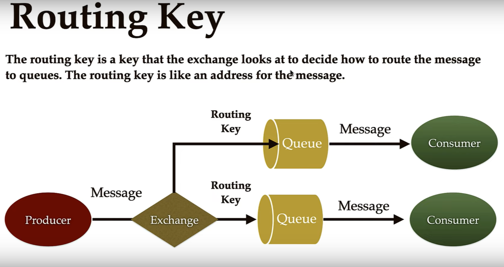

# RabbitMQ Spring Boot Tutorial

This project demonstrates how to integrate RabbitMQ with a Spring Boot application. It provides a REST API to publish messages to a RabbitMQ exchange and a consumer that listens for messages from a queue.

---

## What is RabbitMQ?

**RabbitMQ** is a message broker that enables applications to communicate with each other using messages, following the Advanced Message Queuing Protocol (AMQP).

---

## RabbitMQ Components

- **Producer**: The application or service that sends messages.  
  _In this project: The REST API endpoint and `RabbitMQPublisher` class._

- **Queue**: A buffer that stores messages until they are consumed.  
  _In this project: Defined as `queue_demo` in the configuration._

- **Exchange**: Receives messages from producers and routes them to queues based on rules.  
  _In this project: Defined as `exchange_demo`._

- **Routing Key**: A string used by the exchange to decide how to route the message to queues.  
  _In this project: `routing_key_demp`._

- **Binding**: The relationship between an exchange and a queue, using a routing key.  
  _In this project: Binds `queue_demo` to `exchange_demo` with `routing_key_demp`._

- **Consumer**: The application or service that receives messages from the queue.  
  _In this project: The `RabbitMQconsumer` class._



---

## How It Works

1. **REST API**:  
   Send a POST request to `/api/v1/publish?message=YourMessage` to publish a message.

2. **Publisher**:  
   The `RabbitMQPublisher` uses `RabbitTemplate` to send the message to the exchange with the routing key.

3. **Exchange & Binding**:  
   The exchange receives the message and, using the binding and routing key, routes it to the queue.

4. **Consumer**:  
   The `RabbitMQconsumer` listens to the queue and processes incoming messages.


---

## Running the Project

1. Make sure RabbitMQ is running locally (default port: 5672).
2. Build and run the Spring Boot application:
   ```sh
   ./mvnw spring-boot:run
   ```
3. Publish a message:
   ```sh
   curl -X POST "http://localhost:8080/api/v1/publish?message=HelloRabbitMQ"
   ```

---

## File Structure

- `RabbitMQConfig.java` — Configures queue, exchange, and binding.
- `RabbitMQPublisher.java` — Publishes messages to RabbitMQ.
- `RabbitMQconsumer.java` — Consumes messages from RabbitMQ.
- `MessageController.java` — REST API for publishing messages.
- `application.properties` — Spring Boot configuration.

---

## References

- [RabbitMQ Official Documentation](https://www.rabbitmq.com/documentation.html)